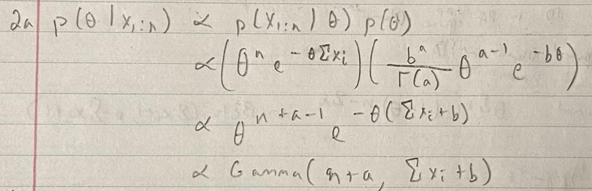
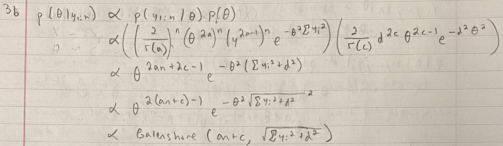
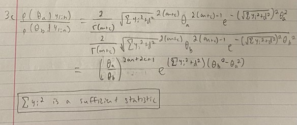
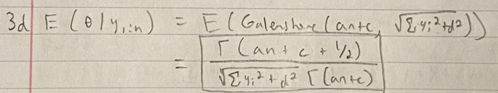
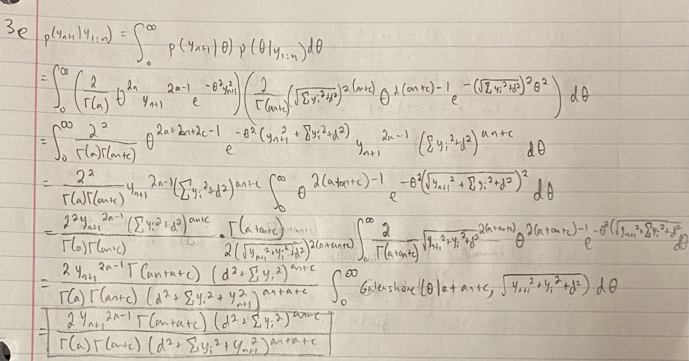

# Question 1: Lab component


```{r}
# used for plots later
library(ggplot2)

# This is pre-existing code from tasks 1, 2 of lab, used in this homework
# set a seed to ensure reproducibility
set.seed(123)
# create the observed data
obs.data <- rbinom(n = 100, size = 1, prob = 0.01)
```


**Task 3**

Write a function that takes as its inputs that data you simulated (or any data of the same type) and a sequence of $\theta$ values of length 1000 and produces Likelihood values based on the Binomial Likelihood. Plot your sequence and its corresponding Likelihood function.

The likelihood function is given below. Since this is a probability and is only valid over the interval from $[0, 1]$ we generate a sequence over that interval of length 1000.

You have a rough sketch of what you should do for this part of the assignment. Try this out in lab on your own. 

```{r, echo = TRUE}
### Bernoulli LH Function ###
# Input: obs.data, theta
# Output: bernoulli likelihood

myBernLH <- function(obs.data, theta) {
  N = length(obs.data)
  x = sum(obs.data)
  LH = (theta^x) * ((1-theta)^(N-x))
  return(LH)
}

### Plot LH for a grid of theta values ###
# Create the grid #
theta.sim <- seq(0, 1, length=1000)
# Store the LH values
sim.LH <- myBernLH(obs.data, theta = theta.sim)
# Create the Plot
plot(theta.sim, sim.LH,
     type='l',
     main='Likelihood for a Grid of Theta Values',
     xlab='Simulated Data',
     ylab='Likelihood')

```

**Task 4**

Write a function that takes as its inputs  prior parameters \textsf{a} and \textsf{b} for the Beta-Bernoulli model and the observed data, and produces the posterior parameters you need for the model. \textbf{Generate and print} the posterior parameters for a non-informative prior i.e. \textsf{(a,b) = (1,1)} and for an informative case \textsf{(a,b) = (3,1)}}.

```{r}
posterior <- function(a, b, obs.data){
  N <- length(obs.data)
  x <- sum(obs.data)
  return(list('a' = a + x, 'b' = b + N - x))
}

noninformative <- posterior(a=1, b=1, obs.data)
informative <- posterior(a=3, b=1, obs.data)

print(noninformative)
print(informative)
```

**Task 5**

Create two plots, one for the informative and one for the non-informative case to show the posterior distribution and superimpose the prior distributions on each along with the likelihood. What do you see? Remember to turn the y-axis ticks off since superimposing may make the scale non-sense.

```{r}
# introduce theta we iterate over, introduce likelihood function
th = seq(0, 1, length=500)
like = myBernLH(obs.data, theta = th)

# prior and posterior of non-informative case
prior = dbeta(th, 1, 1)
post = dbeta(th, noninformative$a, noninformative$b)

# plot prior, likelihood, posterior
plot(th, prior, type='l', ylab='Density', lty = 1, lwd = 3, xlab = expression(theta),
     col='red', yaxt='n')
par(new=TRUE)
plot(th, like, type='l', ylab='Density', lty = 2, lwd = 3, xlab = expression(theta),
     col='green', yaxt='n')
par(new=TRUE)
plot(th, post, type='l', ylab='Density', lty = 3, lwd = 3, xlab = expression(theta),
     col='blue', yaxt='n',main='Non-Informative')
legend('top', lty=c(1,2,3), lwd=c(3,3,3), col=c('red','green','blue'), 
       legend=c('prior', 'likelihood', 'posterior'))

# prior and posterior of informative case
prior = dbeta(th, 3, 1)
post = dbeta(th, informative$a, informative$b)

# plot prior, likelihood, posterior
plot(th, prior, type='l', ylab='', lty = 1, lwd = 3, xlab = '', col='red', yaxt='n')
par(new=TRUE)
plot(th, like, type='l', ylab='', lty = 2, lwd = 3, xlab = '', col='green', yaxt='n')
par(new=TRUE)
plot(th, post, type='l', ylab='Density', lty = 3, lwd = 3, xlab = expression(theta), 
     col='blue', yaxt='n',main='Informative')
legend('top', lty=c(1,2,3), lwd=c(3,3,3), col=c('red','green','blue'), 
       legend=c('prior', 'likelihood', 'posterior'))
```

We see for the non-informative prior (the beta(1,1) distribution that is essentially a uniform distribution), the posterior and prior distributions are the same. For the informative prior that weighs towards a higher theta, the posterior is averaged between the likelihood and prior, but with much higher weighting for the likelihood and is nearly equivalent to it. The posterior for the non-informative prior returns a distribution to the right of the distribution for the informative prior, due to the required averaging. The importance of the likelihood is higher for a non-informative prior compared to an informative prior.

# Question 2: The Exponential-Gamma Model

**2a. Derive the formula for the posterior density.**

The posterior density is a Gamma distribution with parameters a + n and b + $\sum_{i=1}^{n} x_{i}$.

```{r figurename, echo=FALSE, out.width = '90%'}

```

**2b. Why is the posterior distribution a proper density or probability distribution function?**

We know our posterior distribution to be a Gamma distribution. This is a "proper" distribution as it integrates to 1 over all possible values of theta.

**2c. Plot the prior and posterior pdfs.**

Prior: Gamma(0.1, 1.0).
Data: {20.9, 69.7, 3.6, 21.8, 21.4, 0.4, 6.7, 10.0}.

```{r}
# inputting data and priors
th = seq(0, 1, length=500)
data = c(20.9, 69.7, 3.6, 21.8, 21.4, 0.4, 6.7, 10.0)
a = 0.1
b = 1.0

# prior and posterior are gamma, likelihood is exponential distribution
prior = dgamma(th, shape = a, rate = b)
likelihood = dexp(th, rate = sum(data)/8)
posterior = dgamma(th, shape = a + length(data), rate = b + sum(data))

# plot prior, likelihood, posterior (no plotting likelihood)
plot(th, prior, type='l', ylab='Density', lty = 1, lwd = 3, xlab = expression(theta),
     col='red', yaxt='n')
par(new=TRUE)
#plot(th, likelihood, type='l', ylab='Density', lty = 2, lwd = 3, xlab = expression(theta),
#     col='green', yaxt='n')
#par(new=TRUE)
plot(th, posterior, type='l', ylab='Density', lty = 3, lwd = 3, xlab = expression(theta), 
     col='blue', yaxt='n',main='Exponential-Gamma Model')
legend('top', lty=c(1,3), lwd=c(3,3), col=c('red','blue'), 
       legend=c('prior', 'posterior'))
```

**2d. Give a specific example of an application where an Exponential model would be reasonable. Give an example where an Exponential model would NOT be appropriate, and explain why.**

An exponential model would be reasonable for modeling something like waiting times. A specific example might be modeling how long it takes for a car accident to occur at a given highway entrance point or intersection.

An exponential model would not be reasonable for an event that can be explained differently based on the 'current' situation. A specific example might be modeling how many more miles a car can drive before falling apart. A car with hunderds of thousands of miles already driven will have a much different chance of falling apart in the next 100 miles than a new car falling apart in the next 100 miles, so an exponential model that would characterize them as having an equal chance (since the exponential distribution has memorylessness) would not be helpful.


# Question 3: Priors, Posteriors, Predictive Distributions

**3a. Identify a class of conjugate prior densities for theta. Plot a few members of this class of densities.**

The Galenshore distribution itself serves as a class of conjugate prior densities in this case.

```{r}
# using provided formula to create galenshore function for c, d
galenshore.dist <- function(theta, c, d){
  probability = 
    (2 / factorial(c-1)) * d ^ (2*c) * theta ^ (2*c-1) * exp(-1 * d^2 * theta^2)
  return(probability)
}

# iterating over a reasonable set of thetas that include nearly all of the probability
theta <- seq(0, 5, length=500)

# plotting (1,1),(2,1),(3,1),(1,2),(1,3)
ggplot() + 
  geom_line(aes(x = theta, y = galenshore.dist(theta, 1, 1), color='1,1')) +
  geom_line(aes(x = theta, y = galenshore.dist(theta, 2, 1), color='2,1')) +
  geom_line(aes(x = theta, y = galenshore.dist(theta, 3, 1), color='3,1')) +
  geom_line(aes(x = theta, y = galenshore.dist(theta, 1, 2), color='1,2')) +
  geom_line(aes(x = theta, y = galenshore.dist(theta, 1, 3), color='1,3')) + 
  labs(x = expression(theta), y = "Density",
       title = "A Few Members of Galenshore Prior Densities") +
  scale_color_manual(name = "Priors", values = c("1,1" = "red",
                                                   "2,1" = "green",
                                                   "3,1" = "blue",
                                                   "1,2" = "black",
                                                   "1,3" = "yellow"))
```

**3b. Let $Y_{1}, ..., Y_{n}$ ~ Galenshore(a, $\theta$). Find the posterior distribution of $\theta$ | $y_{1:n}$ using a prior from your conjugate class.**

We will show that a variant of the Galenshore distribution, specifically with parameters an + c and $\sqrt{\sum{y_{i}^2} + d^2}$ serves as the posterior by showing the posterior is proportional to the kernel of the Galenshore distribution.

```{r figurename2, echo=FALSE, out.width = '90%'}

```

**3c. Write down p($\theta_{a}$ | $y_{1:n}$) / p($\theta_{b}$ | $y_{1:n}$) and simplify. Identify a sufficient statistic.**

When simplifying this proportion, we see that the sum of the squares of each $\sum{y_{i}^2}$ is a sufficient statistic, as it is enough information to make inference about $\theta$. Below is my work.

```{r figurename3, echo=FALSE, out.width = '90%'}

```

**3d. Determine E[$\theta$ | $y_{1:n}$].**

I utilized the provided formula for E[Y] for this, since E[$\theta$ | $y_{1:n}$] (the posterior distribution) is also performed on a type of Galenshore distribution. Below is my solution.

```{r figurename4, echo=FALSE, out.width = '90%'}

```

**3e. Show the posterior predictive density of p($y_{n+1}$ | $y_{1:n}$).**

For this problem, I utilized the fact that the Galenshore distribution is a proper distribution to move constants out of the integral such that I had an integral over all possible values of a particular Galenshore distribution multiplied by a massive constant. Since the Galenshore distribution is proper, we can presume that integral is equal to 1, making the massive constant the answer.

```{r figurename5, echo=FALSE, out.width = '90%'}

```