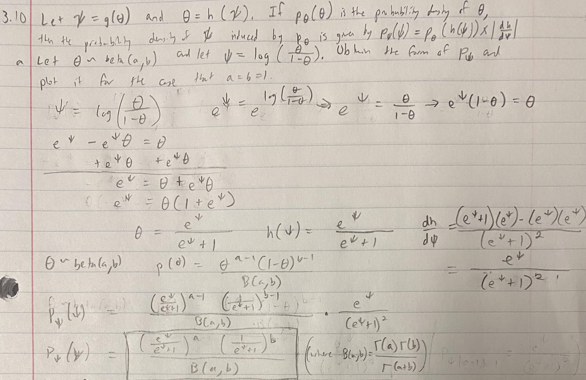
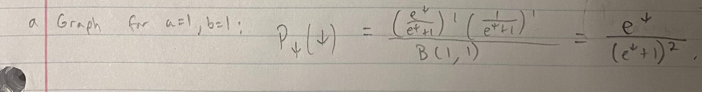
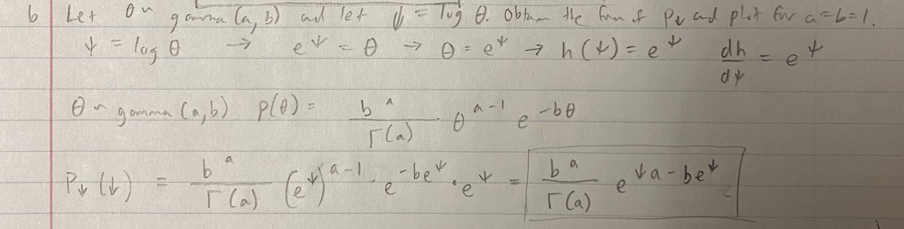
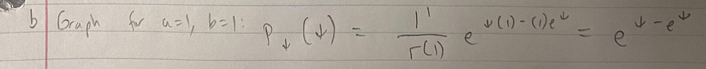

Total points: 10 (reproducibility) + 10 (Q1) + 25 (Q2) = 45 points.\

**General instructions for homeworks**: Please follow the uploading file instructions according to the syllabus. You will give the commands to answer each question in its own code block, which will also produce plots that will be automatically embedded in the output file. Each answer must be supported by written statements as well as any code used. Your code must be completely reproducible and must compile. 

**Advice**: Start early on the homeworks and it is advised that you not wait until the day of. While the professor and the TA's check emails, they will be answered in the order they are received and last minute help will not be given unless we happen to be free.  

**Commenting code**
Code should be commented. See the Google style guide for questions regarding commenting or how to write 
code \url{https://google.github.io/styleguide/Rguide.xml}. No late homework's will be accepted.

1. (10 points, 5 points each) Hoff, 3.10 (Change of variables).

3.10a.

```{r, out.width ="100%", out.height = "100%"}

```

We will plot this for a = 1, b = 1. Below is the equation to plot for this case.

```{r, out.width ="100%", out.height = "100%"}

```

```{r}
psi = seq(-10, 10, by = 0.01)
density = exp(psi) / ((exp(psi) + 1) * (exp(psi) + 1))

qplot(psi, density, geom = 'line',
      main = 'Probability density of Psi induced by probability density of Theta,
      for Theta ~ Beta(1, 1) and Psi = log(Theta/(1-Theta))', 
      xlab = 'Psi', 
      ylab = 'Density')
```

3.10b.

```{r, out.width ="100%", out.height = "100%"}

```

We will plot this for a = 1, b = 1. Below is the equation to plot for this case.

```{r, out.width ="100%", out.height = "100%"}

```
  
```{r}
psi = seq(-10, 10, by = 0.01)
density = exp(psi - exp(psi))

qplot(psi, density, geom = 'line',
      main = 'Probability density of Psi induced by probability density of Theta,
      for Theta ~ Gamma(1, 1) and Psi = log Theta', 
      xlab = 'Psi', 
      ylab = 'Density')
```

2. (15 points total) *Lab component* (25 points total) Please refer to lab 4 and complete tasks 4---5.
(a) (10) Task 4

```{r}
# reproducibility
set.seed(123)

# number of simulations
sim = 10^6


# initialize vectors
lambdas = NULL
lambdac = NULL
mus = NULL
muc = NULL

# creating normal-gamma models with our parameters
lambdas = rgamma(sim, 4, 855)
lambdac = rgamma(sim, 24.5, 6344)
mus = rnorm(sim, 24, sd = sqrt(1/(8 * lambdas)))
muc = rnorm(sim, 11.8, sd = sqrt(1/(49 * lambdac)))

# evaluating the question
mean(mus > muc)
```

This means we assess the probability that spurters' IQ scores change more on average than controls' IQ scores, conditioned on the data provided of their IQ changes over the year, is 0.970645. It is highly likely the mean spurter IQ change is higher than the mean control IQ change. 


(b) (15) Task 5

```{r}
# reproducibility
set.seed(123)

# number of simulations
sim = 1000

# initialize vectors
lambdas = NULL
lambdac = NULL
mus = NULL
muc = NULL

# creating normal-gamma model with our priors (same for spurters/controls)
lambdas = rgamma(sim, 0.5, 50)
lambdac = rgamma(sim, 0.5, 50)
mus = rnorm(sim, 0, sd = sqrt(1/(1 * lambdas)))
muc = rnorm(sim, 0, sd = sqrt(1/(1 * lambdac)))

# storing data
simPrior = data.frame(lambda = c(lambdas, lambdac),
                      mu = c(mus, muc),
                      Treatment = rep(c("Spurters", "Controls"),
                                      each = sim))
simPrior$lambda = simPrior$lambda^{-0.5}


# plotting data
ggplot(data = simPrior, 
       aes(x = mu, y = lambda, 
           color = Treatment,
           shape = Treatment)) +
  geom_point(alpha = 0.2) +
  labs(x = expression(paste(mu, " (Mean Change in IQ Score)")),
       y = expression(paste(lambda^{-1/2}, " Std. Dev. of Change)"))) +
  ggtitle("Prior Samples") +
  theme(plot.title = element_text(hjust = 0.5)) +
  xlim(-250, 250) +
  ylim(0, 750)


```

This visualization of the prior conforms with our prior beliefs, for the following reasons.

First, we started with the notion that we could not tell if there would be an improvement in IQ over the year and so the mean change is centered around 0.

We similarly had low confidence in how much the spread would be given our lack in confidence in the prior, allowing for a large standard deviation of change. 

Also, we assigned the same prior to the controls and spurters, not establishing them as having different changes in IQ scores or spread of those changes. Both treatment groups have the same prior distribution.
