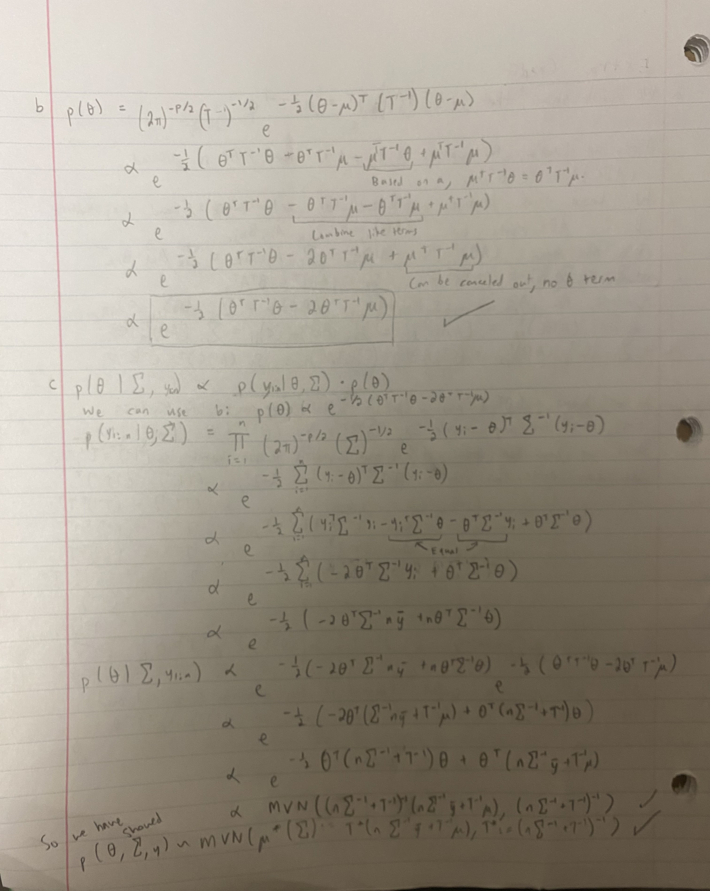

## 1c (Task 3)

We create a function to help us obtain our posterior predictive distributions.
  
```{r}
set.seed(42)
library(MASS)
sim_count = 5000

predict <- function(y) {
  X = cbind(rep(1, 6), seq(1, 11, by = 2))
  beta_init = c(23, 0)
  sigma2_init = rbind(c(0.25, 0), c(0, 0.1))
  sigma2 = 0.7^2
  
  beta_matrix = matrix(nrow = sim_count, ncol = length(beta_init))
  sigma_matrix = numeric(sim_count)

  for (i in 1:sim_count) {
    beta = mvrnorm(1, solve(solve(sigma2_init) + (t(X) %*% X) / sigma2) %*%
                      (solve(sigma2_init) %*% beta_init + (t(X) %*% y) / sigma2),
                      solve(solve(sigma2_init) + (t(X) %*% X) / sigma2))
    sum_squares = (t(y) %*% y) - (2 * t(beta) %*% t(X) %*% y) + (t(beta) %*% t(X) %*%
                                                                   X %*% beta)
    sigma2 = 1 / rgamma(1, (1 + 6) / 2, (1 * 1/4 + sum_squares) / 2)

    beta_matrix[i,] = beta
    sigma_matrix[i] = sigma2
  }
  
  return(rnorm(sim_count, beta_matrix %*% c(1, 13), sqrt(sigma_matrix)))
}

```

We can use the function to obtain our posterior predictive distribution for each swimmer. We use the swimming dat file's data to do this, which has data for each swimmer by row. Our posterior predictive distributions are stored in a table-like structure with each swimmer getting their own column with 5000 simulations of the Gibbs sampler. Provided is a small selection of the first few simulations for each of the 4 swimmers.


```{r}
swim = read.table("swim.dat")
swim_pred = apply(swim, MARGIN = 1, predict)
head(swim_pred)

```

## 1d (Task 4)

We're going to use the posterior predictive distributions' values for each of the simulations to help determine which swimmer is the fastest. Since we are looking at the fastest, we want the swimmer with the smallest time in each run. We can use that to construct the probabilities.

```{r}
fastest_times = apply(swim_pred, MARGIN = 1, which.min)
```


This is the probability that swimmer 1 is the fastest in a given simulation.

```{r}
length(fastest_times[fastest_times==1])/5000
```

This is the probability that swimmer 2 is the fastest in a given simulation.

```{r}
length(fastest_times[fastest_times==2])/5000
```

This is the probability that swimmer 3 is the fastest in a given simulation.

```{r}
length(fastest_times[fastest_times==3])/5000
```

This is the probability that swimmer 4 is the fastest in a given simulation.

```{r}
length(fastest_times[fastest_times==4])/5000
```

Based on these values, in the majority of simulations, swimmer 1 had the quickest time. We would recommend that the coach picks swimmer 1.

## EXTRA CREDIT

```{r  out.width = '110%',echo=FALSE}
knitr::include_graphics("2a.JPG")
```

```{r  out.width = '110%',echo=FALSE}

```

```{r out.width = '110%',echo=FALSE}
knitr::include_graphics("2de.JPG")
```