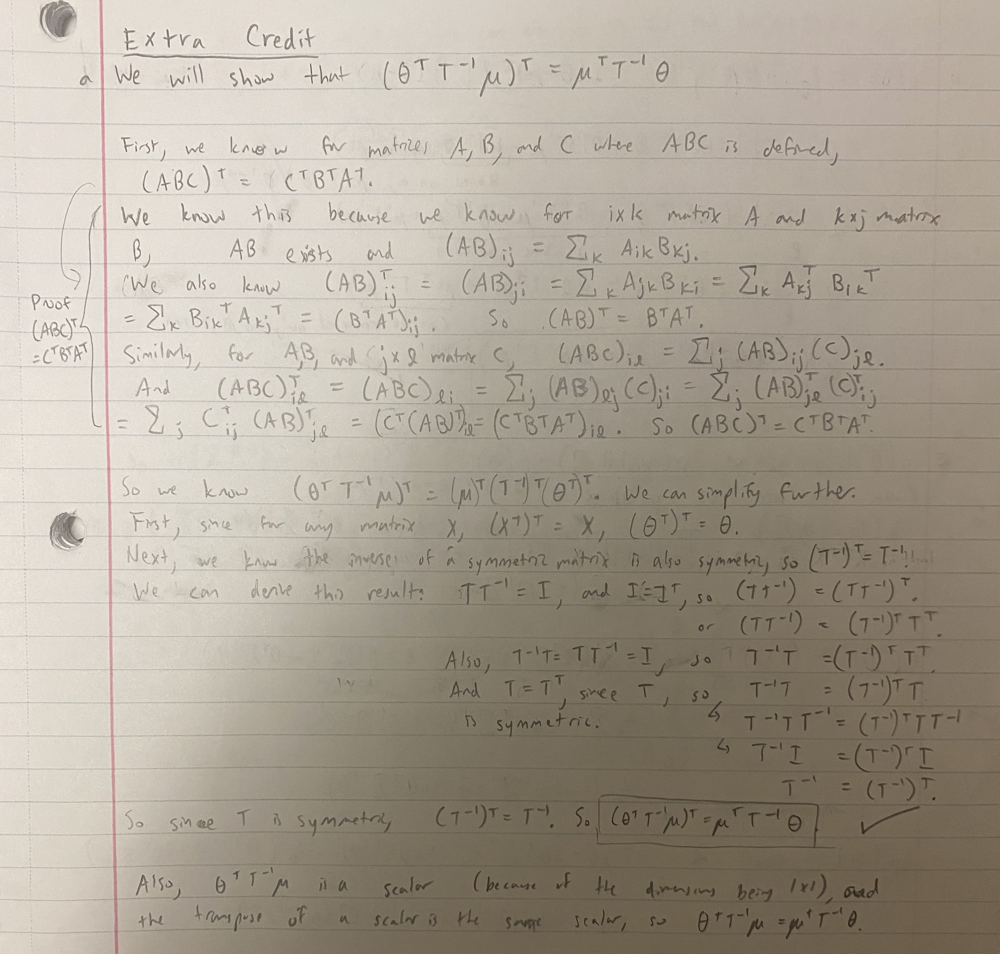
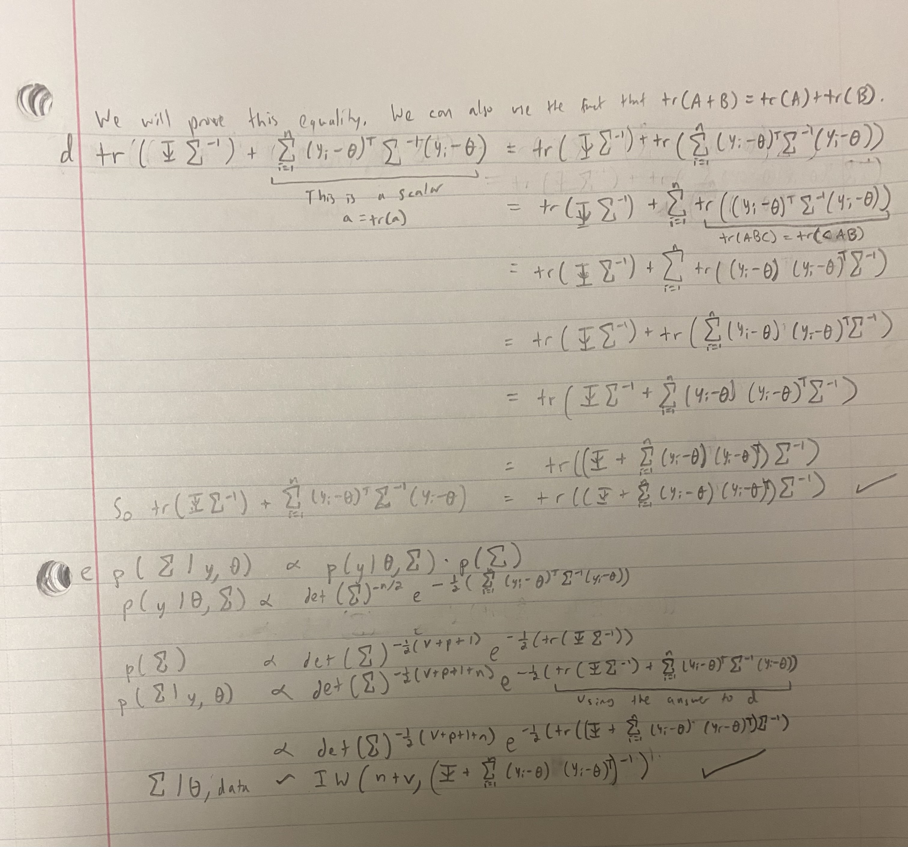

```{r setup, include=FALSE}
knitr::opts_chunk$set(echo = TRUE)
```


```{r out.width = '110%',echo=FALSE}

```

```{r out.width = '110%',echo=FALSE}
knitr::include_graphics("2bc.JPG")
```

```{r out.width = '110%',echo=FALSE}

```
